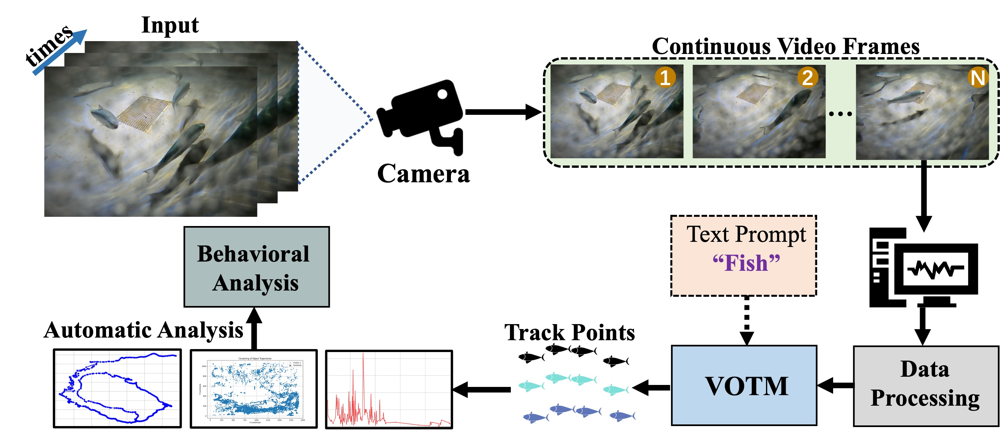
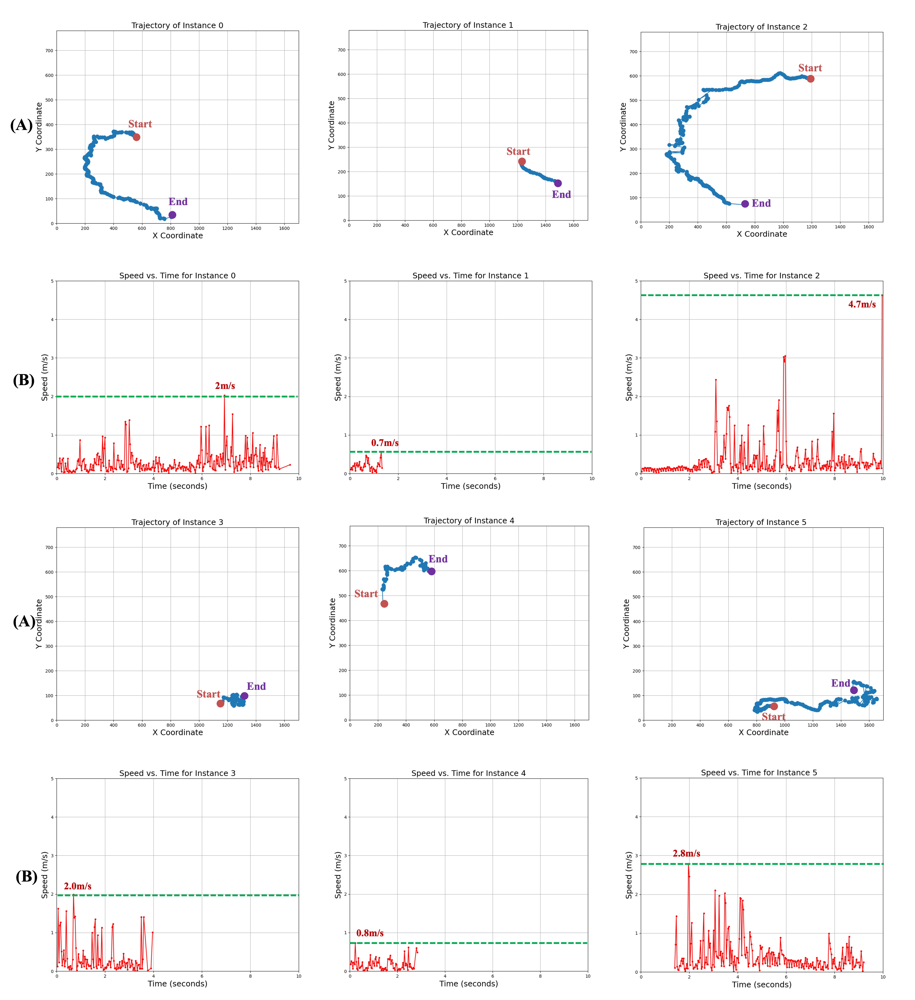
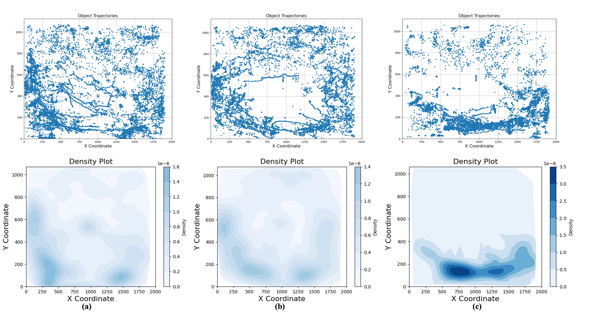

# Quantifying Fish Behavior in Aquaculture Using Visual Open-world Tracking Models (Submitted to Applied Ocean Research)


## Introduction
Monitoring and analyzing fish behaviors is critical for advancing aquaculture management and understanding fish welfare. Traditional methods, such as manual observation and sonar tracking, face significant limitations including inefficiency, low accuracy, and high dependence on experimental conditions. In this paper, we explore the use of the open-world tracking model for fish tracking and behavior analysis based on camera-based observation. We propose a unified framework that integrates fish position extraction and statistical behavior analysis to enable quantitative assessment of fish activities. The framework is validated with real-world fish recordings, where it successfully detects sudden behavioral changes caused by external disturbances. Experimental results demonstrate the potential of our approach to provide robust, scalable, and efficient fish behavior analysis. \textcolor{red}{This work highlights the feasibility of leveraging an open-world tracking model for practical aquaculture monitoring applications.


## Compare with MASA and evaluate TETA metric
If you want to compare with MASA and evaluate your own tracker's results on TAO TETA benchmark, Open-vocabulary MOT benchmark and BDD100K MOT and MOTS benchmarks. Please refer to the [TETA repo](https://github.com/siyuanliii/TETA) for quick evaluation.

## Training
If you want to train the MASA model, please refer to the [train.md](docs/train.md).


## Installation
Please refer to [INSTALL.md](docs/install.md)

## Demo Run
<p align="center">
    
</p>
<p align="center">
    
</p>
<p align="center">
    
</p>
### Preparation
1. First, create a folder named `saved_models` in the root directory of the project. Then, download the following models and put them in the `saved_models` folder.

    a). Download the https://huggingface.co/dereksiyuanli/masa/resolve/main/gdino_masa.pth and put it in `saved_models/masa_models/gdino_masa.pth` folder.

2. (Optional) Second, download the demo videos and put them in the `demo` folder. 
    We provide two short videos for testing (minions_rush_out.mp4 and giraffe_short.mp4). You can download more demo videos [here](https://drive.google.com/drive/folders/1o3cg_GzGHEoLnBaoqBPvL82yTsVWnXdy?usp=sharing).

3. Finally, create the `demo_outputs` folder in the root directory of the project to save the output videos.

### Demo 1:
<p align="center">
    
</p>

```bash
python video_demo_with_text.py demo/minions_rush_out.mp4 --out demo_outputs/minions_rush_out_outputs.mp4 --masa_config configs/masa-gdino/masa_gdino_swinb_inference.py --masa_checkpoint saved_models/masa_models/gdino_masa.pth --texts "fish" --score-thr 0.2 --unified --show_fps
```
* `--texts`: the object class you want to track. If there are multiple classes, separate them like this: `"giraffe . lion . zebra"`. Please note that texts option is currently only available for the open-vocabulary detectors.
* `--out`: the output video path.
* `--score-thr`: the threshold for the visualize object confidence.
* `--detector_type`: the detector type. We support `mmdet` and `yolo-world` (soon).
* `--unified`: whether to use the unified model.
* `--no-post`: not to use the postprocessing. Default is to use, adding this will disable it. The postprocessing uses masa tracking to reduce the jittering effect caused by the detector.
* `--show_fps`: whether to show the fps.
* `--sam_mask`: whether to visualize the mask results generated by SAM.
* `--fp16`: whether to use fp16 mode.

The hyperparameters of the tracker can be found in corresponding config files such as `configs/masa-gdino/masa_gdino_swinb_inference.py`. Current ones are set for the best performance on the demo video. You can adjust them according to your own video and needs.

